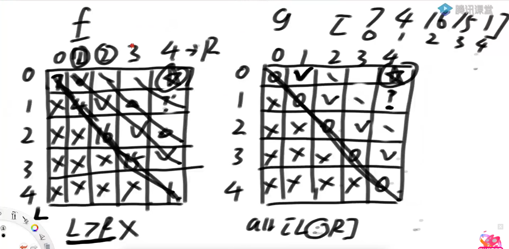

# <font color="red">**动态规划**</font>
**如果发现有重复调用的过程。动态规划在算过一次之后，将结果直接存下来。下一次要用到的时候，直接拿【空间换时间】**
**也就是缓存**

### 机器人走路【Code01】
返回所有的可选方案有多少种。
```text
    /**
	 * n:一共有多少个位置
	 * start:机器人的初始位置
	 * aim：目标是去到哪个位置
	 * K;一共可以走多少步
	 * @date 2021-07-19 16:29:00
	 */
	 public static int ways1(int N, int start, int aim, int K) {
		
	 }
```

### 纸牌分数题【Code02】

```text
给定一个整型数组arr，代表数值不同的纸牌排成一条线
玩家A和玩家B依次拿走每张纸牌
规定玩家A先拿，玩家B后拿
但是每个玩家每次只能拿走最左或最右的纸牌
玩家A和玩家B都绝顶聪明
请返回最后获胜者的分数。 
```

