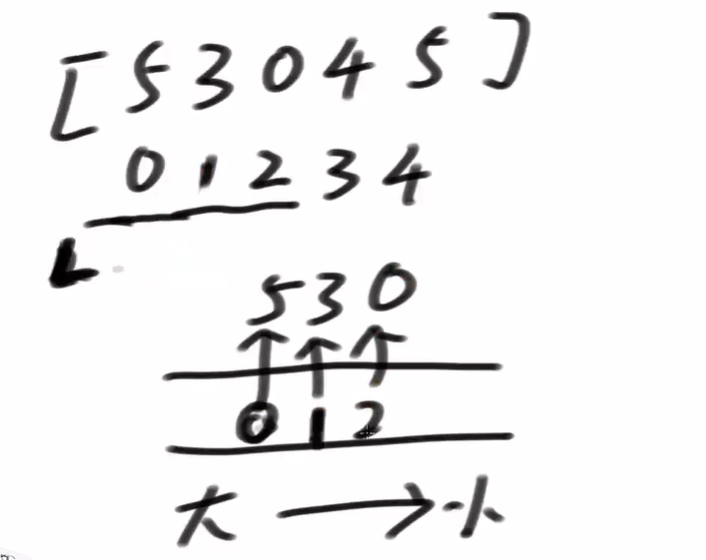

# **滑动窗口**  

**滑动窗口是一种想象出来的数据结构： 滑动窗口有左边界L和有边界R 在数组或者字符串或者一个序列上，记为S，窗口就是S[L..R]这一部分 L往右滑意味着一个样本出了窗口，R往右滑意味着一个样本进了窗口 L和R都只能往右滑**    

### 滑动内最大值和最小值的更新结构    
窗口不管L还是R滑动之后，都会让窗口呈现新状况， 如何能够更快的得到窗口当前状况下的最大值和最小值？ 最好平均下来复杂度能做到O(1)    
利用单调双端队列！    

做法是：设置一个双端队列，左边大，右边小。扩大窗口【R++】的时候，将扩进来的数与队列的右边的数比较，   
扩进来的数大于等于队列最右边的数，就让队列最右边的数出队列。 再将扩进来的数与新的最右侧数比较，以此类推。    
直到最右侧的数大于扩进来的数【出队列的数就不在进来了】    
之所以出队列后不在进来,是因为当前进来的数比前面的数大，而且随着窗口的滑动，当前的值还比前面的值晚过期。    
**双端队列的含义：假设此时我让窗口依次缩小的话【L++】，哪些位置上的数会依次成为窗口内的最大值**    
    

### 题目一  
**【Code01】**  
假设一个固定大小为W的窗口，依次划过arr， 返回每一次滑出状况的最大值   
例如，arr = [4,3,5,4,3,3,6,7], W = 3   
返回：[5,5,5,4,6,7]    

### 题目二  
**【Code02】**  
给定一个整型数组arr，和一个整数num 某个arr中的子数组sub，  
如果想达标，必须满足： sub中最大值 – sub中最小值 <= num， 返回arr中达标子数组的数量    

窗口内： max - min <= sum    
1. 当范围变大，也就是窗口变大，max只会变大，不会变小。min只会变小，不会变大。  
【当一个小的窗口内不满足该等式，窗口变大也不会满足】    
2. 当范围变小，也就是窗口变小，max只会变小，不会变大。min只会变大，不会变小。  
【当一个大的窗口内满足该等式，其所有的子窗口也满足该等式】    

### 题目三  
**【Code03】**    
加油站的良好出发点问题。【只能正向走，不能逆向走】    
LeetCode上，该题是阉割版。    
正式版：     
给定两个数组：    
gas[]:油数组               
gas[index]:index号加油站有 gas[index] 个单位的油    
cost[]:耗费油的数组         
cost[index]:从index号加油站出发，到下一个加油站的距离是 cost[index] 。也就是需要耗费 cost[index] 个单位的油    
cost[length-1]：表示从后一个站点到第一个站点的距离，也就是回程    
问：假设邮箱无穷大，从哪个站点开始，才能转完一圈。【返回从所有加油站开始，能不能跑完一圈的结果数组】【T、F、T、F、F、F】    

### 题目四  
**【Code04】**    
arr是货币数组，其中的值都是正数。再给定一个正数aim。 每个值都认为是一张货币， 返回组成aim的最少货币数   
注意： 因为是求最少货币数，所以每一张货币认为是相同或者不同就不重要了    

