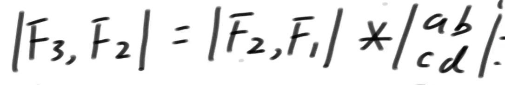
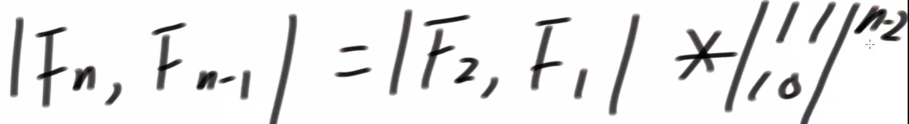
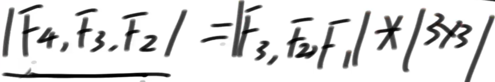
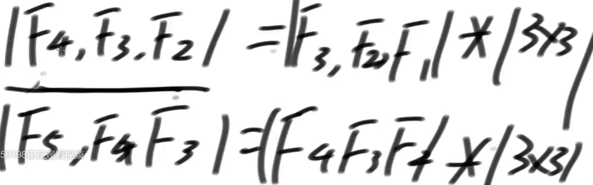
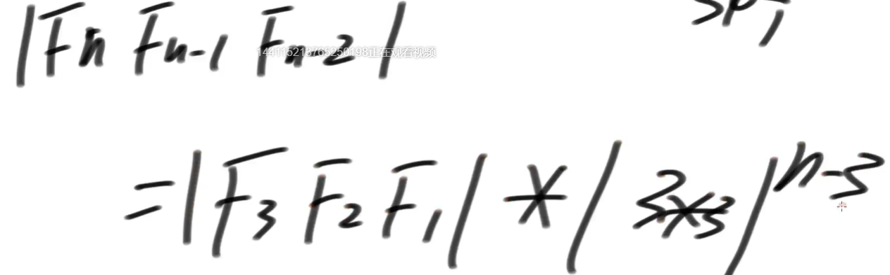
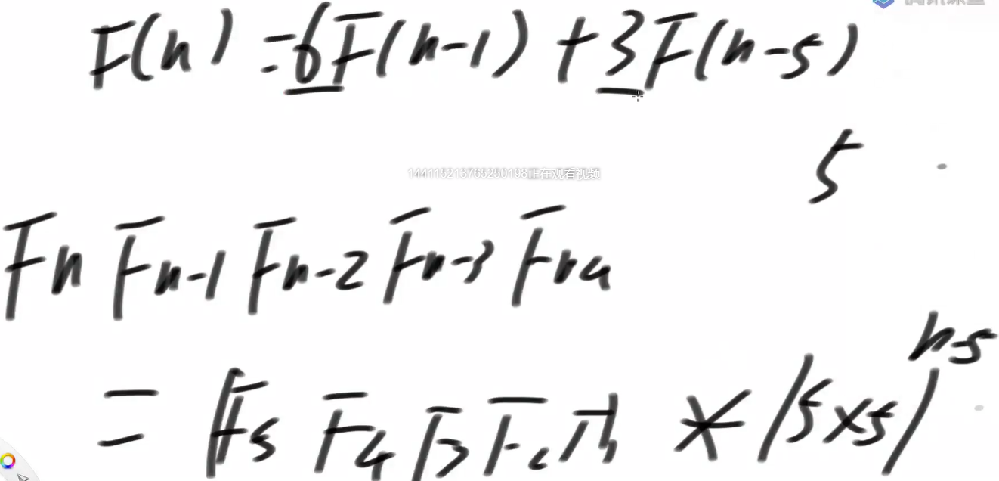
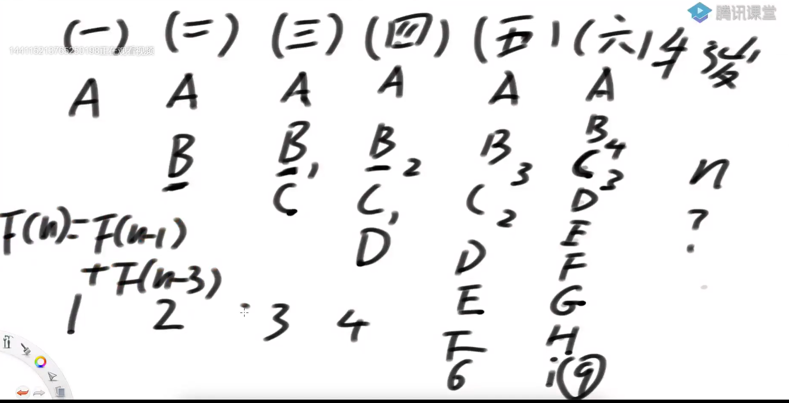

# **斐波那契数列**  

### 单调栈是什么？  
一种特别设计的栈结构，为了解决如下的问题：  

给定一个可能含有重复值的数组arr，i位置的数一定存在如下两个信息  
1）arr[i]的左侧离i最近并且小于(或者大于)arr[i]的数在哪？  
2）arr[i]的右侧离i最近并且小于(或者大于)arr[i]的数在哪？  
如果想得到arr中所有位置的两个信息，怎么能让得到信息的过程尽量快。  

那么到底怎么设计呢？  

### 题目一  
**【Code01】**  
单调栈解决最小数问题  

### 题目二
**【Code02】**    
斐波那契数列。快速求第n项。正常情况下，时间复杂度是 O(n)  
要做到时间复杂度 O(logN)  
*F(n) = F(n-1) + F(n-2)*  
*F(1) = 1*  
*F(2) = 1*  
可以利用行列式的思想去解决【适合于无条件转移的，也就是严格的递推式】  
  
  
F(n) = F(2)*1 +F(1)*1 （利于矩阵的计算方式计算）  

图2是利用递推的思想，带入消除得到的。  
  
  
  
  
【递推式不连续的也行。取的是最低项】  

【最多的是 n-2 所以对应的基矩阵是二阶的，如果最多的是 n-k，那么其基矩阵也是k阶的】  

### 题目三  
**【Code02】**  
  
第一年农场有1只成熟的母牛A，往后的每年：  
1. ）每一只成熟的母牛都会生一只母牛  
2. ）每一只新出生的母牛都在出生的第三年成熟  
3. ）每一只母牛永远不会死  
返回N年后牛的数量  
  

### 题目四  
**【Code03】**  
给定一个数N，想象只由0和1两种字符，组成的所有长度为N的字符串  
如果某个字符串,任何0字符的左边都有1紧挨着,认为这个字符串达标  
返回有多少达标的字符串  

观察法：其实就是初始项为1，第二项为2的斐波那数列问题【写出前几项，观察得出】  
尝试法：【从左往右】后面还有n个位置。前一个位置必须是1的情况下，算出后面还有多少种情况。【函数的定义】  

【如果当前位置是1，直接递归f(i+1)】  
【如果当前位置是0,那么i+1的位置必须是1，直接递归f(i+2)】  

### 题目五  
**【Code03】**  
用1*2的瓷砖，把N*2的区域填满  

返回铺瓷砖的方法数  

