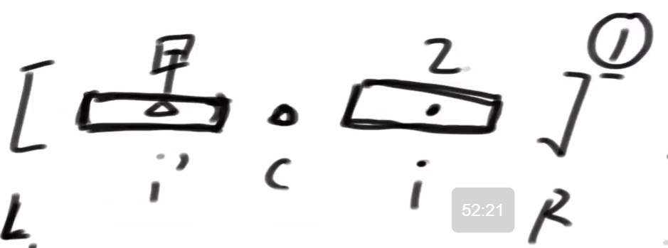
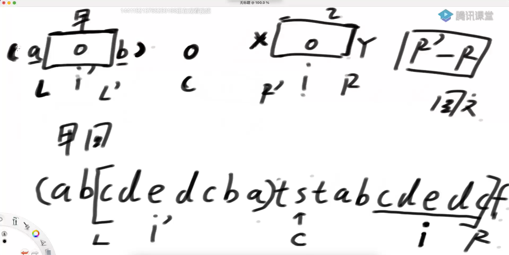
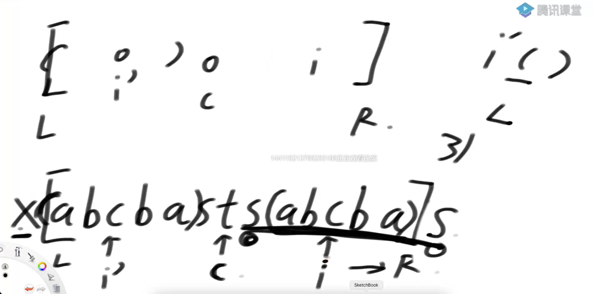

# <font color="red">**Manacher算法**</font>

### Manacher算法是什么？
```text
假设字符串str长度为N，想返回最长回文子串的长度  

时间复杂度O(N)  
```

### Manacher算法核心
1. 理解回文半径数组  
2. 理解所有中心的回文最右边界R，和取得R时的中心点C  
3. 理解   L…(i‘)…C…(i)…R  的结构，以及根据i’回文长度进行的状况划分  
    1. i 没有被 R 罩住，不能简化，按照暴力方法去求解【比较左、右情况】  
    2. i 被 R 罩住。也就是存在 L…(i’)…C…(i)…R  的结构。     
        ①、i’的回文区域在[L...R]的内部，那么 i 位置的回文长度就等于 i' 的回文长度。【它们都是关于 C 对称的】  
          
        ②、i’的回文区域超过[L...R]的范围，那么 i 位置的回文半径就等于 i 到R的长度。【它们都是关于 C 对称的】  
          
        ③、i’的回文区域与[L...R]的左边界重合，那么 i 位置的回文半径大于等于 i'【是否会更大，不确定】。【它们都是关于 C 对称的】   
          

4. 每一种情况划分，都可以加速求解i回文半径的过程  


### 题目一  
**【Code02】**  
在一个字符串中，只能在字符串的后面添加字符。为了使该字符串变成回文串，至少需要添加多少个字符。  
解决方案是：必须包含最后一个字符串的情况下，最长回文串是多长。。再将该回文串前面的部分逆序过来，就是需要添加的字符串   
在向右扩的过程中，当右边界来到最右的位置的时候。就是我们要的【包含最后一个字符串的情况下，最长回文串】  

