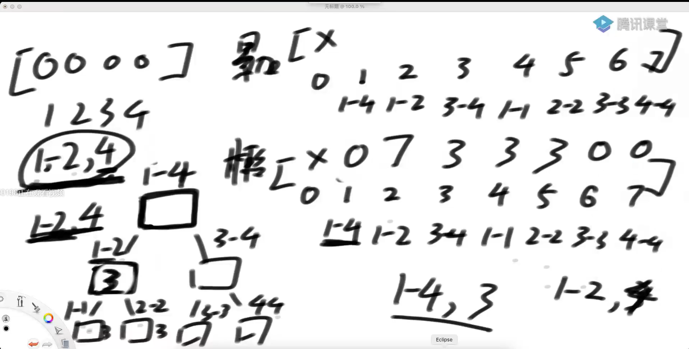

# <font color="red">**线段树**</font>

### 线段树是什么？
```md
1，一种支持 数组范围整体修改和范围整体查询的数据结构

2，解决的问题范畴：
大范围信息可以只由左、右两侧信息加工出，
而不必遍历左右两个子范围的具体状况
 
时间复杂度都是O(logN)
```

### 线段树实例一
```md
给定一个数组arr，用户希望你实现如下三个方法
1）void add(int L, int R, int V) :  让数组arr[L…R]上每个数都加上V
2）void update(int L, int R, int V) :  让数组arr[L…R]上每个数都变成V
3）int sum(int L, int R) :让返回arr[L…R]这个范围整体的累加和

怎么让这三个方法，时间复杂度都是O(logN)

```


### 线段树实例二
```md
想象一下标准的俄罗斯方块游戏，X轴是积木最终下落到底的轴线
下面是这个游戏的简化版：
1）只会下落正方形积木
2）[a,b] -> 代表一个边长为b的正方形积木，积木左边缘沿着X = a这条线从上方掉落
3）认为整个X轴都可能接住积木，也就是说简化版游戏是没有整体的左右边界的
4）没有整体的左右边界，所以简化版游戏不会消除积木，因为不会有哪一层被填满。

给定一个N*2的二维数组matrix，可以代表N个积木依次掉落，
返回每一次掉落之后的最大高度
```
[实例二原题目出处](https://leetcode.com/problems/falling-squares/)


### 例题
```md
有很多民居，1到n号房子，颜色有56中，可以任意的将房子刷成某种颜色
update():将L,R范围上的房子全部刷成某种颜色
query():检查L,R范围上员工有多少种颜色的房子

解决方法：线段树。也可以利用一个 long 类型（64位）来表示某种颜色是否出现过。最后直接统计位数好了
```
