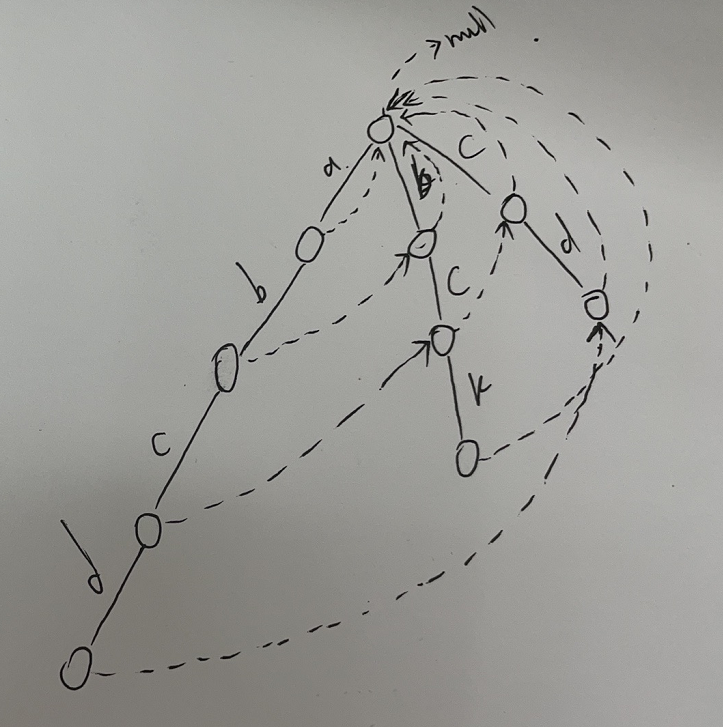

# <font color="red">**IndexTree和AC自动机**</font>

### IndexTree是什么
<font color="red">**特点：**</br></font>
1. 支持区间查询  
2. 没有线段树那么强，但是非常容易改成一维、二维、三维的结构  
3. 只支持单点更新【不支持范围更新】  


### IndexTree的实现
1. 把所有匹配串生成一棵前缀数组【1-----1、2-----3-----1、2、3、4-----5-----5、6-----7-----1、2、3、4、5、6、7、8...】  
   【每个位置看看有没有能和它本身分在一组的】【实现前缀和数组】  
```javascript

sum[1] = arr[1];                            // 前面没有能与其分一组的
sum[2] = arr[1] + arr[2];                   // 2位置出现的时候，发现前面有一个 1 是单独存在的，可以与其分一组
sum[3] = arr[3];                            // 3位置出现的时候，前面只有一组两个数的【被合并的不算】，没有能与之个数一样的
sum[4] = arr[1] + arr[2] + arr[3] + arr[4]; // 3位置出现的时候，首先前面的 3 位置是一个数，可以合进来，合进来以后，变成了两个数，前面的 1、2 也是两个数，也可以合进来
sum[5] = arr[5];                            // 5位置出现的时候，前面没有能与其分一组的
sum[6] = arr[5] + arr[6];                   // 6位置出现的时候，发现前面有一个 5 是单独存在的，可以与其分一组
sum[7] = arr[7];                            // 7位置出现的时候，前面没有能与其分一组的
sum[8] = arr[1] + arr[2] + arr[3] + arr[4] + arr[5] + arr[6] + arr[7] + arr[8];

// ......
```

2. 看每个前缀和数组位置所管的范围【当前位置的下标的二进制的最后一个 1 变成0，再加 1 的二进制就是当前下标所管的范围的起始位置，所管范围的终点位置就是当前下标本身】  
3. 要求某个位置的前缀和时【在前缀和数组中，取当前位置的数，再加上 （该位置的二进制去掉最后一个 1 在前缀和数组中所对应的位置的数），  
   再加上 再抹掉最后一个1的前缀和数组中所对应位置的数...，依次类推，直到该位置对应二进制的 1 都变为 0 为止】  
4. 时间复杂度【单点更新及求前缀和都是 logN】  


### IndexTree二维
help[i,j] : 表示的是以[1,1]的位置为起点。到[i,j]位置的一个方块范围的累加和。  
如果要求任意一点[a,b]到任意一点[c,d]框起来的数的累加和  

help[c,d] - help[a,d] - help[c,b] + help[a,b]  

【画图，简单明了】  


在原数组中，行的二进制和列的二进制被改变时，哪些位置的数会发生改变  
推理：行号管行号的，列号管列号的。不管是行和列。都是按照一维的规则来推  
看每个前缀和数组位置所管的范围【当前`行（列）`的最后一个 1 变成0，  
再加 1 的二进制就是当前`行（列）`所管的范围的起始位置，所管范围的终点位置就是当前`行（列）`本身】  

时间复杂度：【log行 * log列】  

具体证明`略`  

三维、四维等高维以此类推  


### AC自动机是什么？
解决在一个大字符串中，找到`多个`候选字符串的问题  

##### 前缀树
从跟节点开始，每条边代表一个字符。在某个节点，有对应的边，直接复用，没有就新建  
  


### AC自动机算法核心
1. 把所有匹配串生成一棵前缀树  

2. 前缀树节点增加fail指针  

3. fail指针的含义：如果必须以当前字符结尾，当前形成的路径是str，str的后缀和剩下字符串的前缀，哪一个拥有`最大`的匹配长度。fail指针就指向那个字符串的最后一个字符所对应的节点。（迷不迷？听讲述！）  

4. 在进行匹配的时候，丛头节点出发，来到一个节点，检查是否有以该节点结尾的敏感字，【有，就收集答案。没有，就沿着当前节点的 fail 指针走一遍，去收集答案】  
   收集完成后，跳到下一个节点。【如果匹配失败，也沿着当前节点的 fail 指针跳到下一个节点】  


先建立前缀树，建立完成后，再根据宽度优先的遍历方式，去设置 fail 指针  

头节点的 fail 指针，一律指向空。  
头节点的直接子节点，fail 指针一律指向头结点  
对于其他节点：某个节点`X`的父亲节点`Y`,考察父节点`Y`的 fail 指针指向的节点，是否有出路与本节点`X`的入路一致  
【如果没有，就考察父节点的 fail节点，一直 fail节点 往上，如果都没有 出路与本节点`X`的入路一致。那么当前节点`X`的 fail 指针直接指向头】  
【如果有，那么`X`的 fail 指针就指向 对应节点 的出路 所对的节点】  

  

  