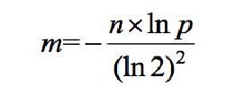
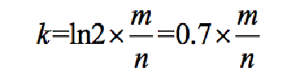
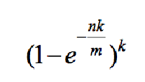
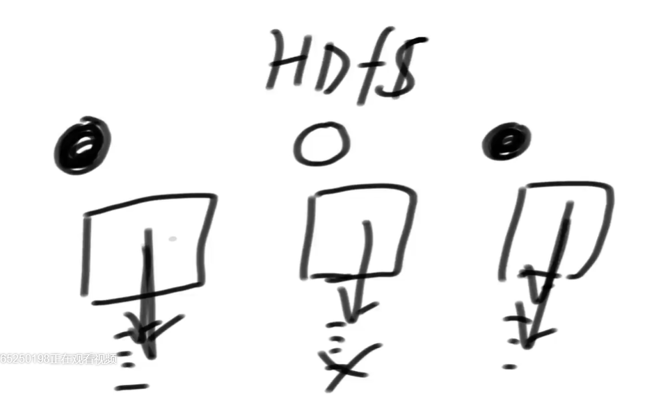
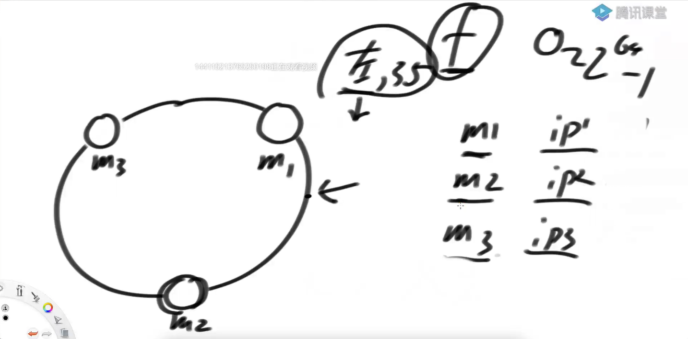

# <font color="red">**认识哈希函数 -> out f(in data)**</font>

### 哈希是什么
1. 输入参数data，假设是in类型，特征：可能性无穷大，比如str类型的参数
2. 输出参数类型out，特征：可能性可以很大，但一定是有穷尽的
3. 哈希函数没有任何随机的机制，固定的输入一定是固定的输出
4. 输入无穷多但输出值有限，所以不同输入也可能输出相同（哈希碰撞）
5. 再相似的不同输入，得到的输出值，会几乎均匀的分布在out域上

<font color="red">**重点：第5条！**</br></font>


### 哈希函数作用：可以把数据根据不同值，几乎均匀的分开

###### 哈希表的设计

```shell
# hash表是数组加链表实现的
# 开始的时候，初始化一个数组【数组的初始长度是一个经验值，不同的语言有所不同】。
# 添加值的时候，会将添加进来的值的 key 去计算hash值，hash值是一个很大的16进制的数
# 不同的算法，计算出来的hash值，其长度会有所不同。但是因为hash值具有散列性（在0到2^l范围内是均匀分布的）【l是hash值的长度】
# 计算出来hash值后，再将其与数组的长度取模，就会得到一个 0~L（数组长度）的值【基于其散裂性，每个hash值取模后，落在数组每个位置上的几率相等】
# 将每个key值对就存在其取模后的位置【可能会出现取模后相同的情况，所以数组上的每个位置存的是链表】【读取的时候也是遍历链表】

# 数组的扩容。【当每个数组上的链表达到一定长度（也是经验值）（当达到这个长度，遍历起来就会比较慢），就会进行数组扩容（翻倍），
# 扩容后，所有的数据重新计算hash值，重新存储】

# 添加的时候时间复杂度是 O(1)【变动的数，都是翻倍的去变动。总变动数 = 数组初始长度l +2l + 4l + 8l + 16l ...,无限接近 2N 】
# 【均摊到每个数 2N/N .也就是常数时间】
# 每次扩容，也会适当的调整链表长度【以求达到最优（根据遍历时候的性能调整）】

# 链表：在工程上也会换成其他的数据结构。比如红黑树[同等情况下，能增加单个链表的长度]。但是这不影响时间复杂度。其优化的一般都是常数时间复杂度
```


### 布隆过滤器
<font color="red">**要使用布隆过滤器之前，先问问面试官，允许有失误率吗！**</br></font>
1. 利用哈希函数的性质
2. 每一条数据提取特征
3. 加入描黑库
4. 不支持删除样本操作

```shell
# 实现类似于黑名单的机制。
# 黑白名单：有请求进来的时候，直接查询hash表。但是由于黑白名单的每条记录比较长，会占用大量的空间。布隆过滤器就是为了节省空间

# 实现方式如下
# 准备长度为 m 的bite数组。和 n 个hash 函数。初始的时候，将每个字符串依次经过 n 个hash函数后，再对 m 取模，得到一个 （0,m-1） 的位置
# 在长度为 m 的bite数组中，将对应的位置标位 1.第二个、第三个...第 n 个hash函数也经过同样的过程，标记数组中的对应位置
# 查询的时候，将要查询的字符串，经过上面同样的过程，如果 n 个函数得到的位置都是 1.那么该字符串在黑白名单上
# 至于函数的个数。一般是经验值。函数个数愈多，失误率越低


# 问题？ 
# hash函数定多少个？？ m长度的数组定多长？？
# hash函数个数愈多，失误率越低。但是hash函数太多，就会将 m 长度的数组填满，也会导致失误率升高。选择合适的 hash 函数的个数比较重要
# m的长度，一般需要关注几个重要因素【样本总量、失误率】

# hash函数哪找去
# 只需要两个hash函数(f1和f2)（f1是第一个hash函数的返回值，f2是第二个hash函数的返回值）。其他的自己造去
# 1、  1*f1+f2
# 2、  2*f1+f2
# 3、  3*f1+f2
# 4、  4*f1+f2
# .、  ......
# k、  k*f1+f2


# 计算公式如下
```

### 布隆过滤器重要的三个公式
1. 假设数据量为n，预期的失误率为p（布隆过滤器大小和每个样本的大小无关）
2. 根据n和p，算出Bloom Filter一共至少需要多少个bit位，向上取整，记为m【可以向面试官多要点】
3. 根据m和n，算出Bloom Filter需要多少个哈希函数，向上取整，记为k【带入真实的m长度。向上取整后就是真实的函数个数】
4. 根据修正公式，算出真实的失误率p_true【真实的m空间，真是的函数个数】






### 布隆过滤器在 HDFS 中的应用
```shell
# hdfs 中是分块存储的
# 每个小块维护一个自己的布隆过滤器
# 查询的时候，在每个小块的布隆过滤器里面走一遍，找到对应的块位置，再去找对应的记录就好了
```



### 一致性哈希
分布式存储结构最常见的结构。解决的是数据存储的问题

1. 哈希域变成环的设计
```shell
# 利用hash值对服务器个数取模，得到存储的服务器节点。【在该机制下，为了让服务器均匀服务。
# 可以将hash key分为多个等级（如高频、中频、低频等）】【缺点是不利于增减节点】
# 一致性hash环的出现，就是为了便于增减节点
# 设计hash函数的时候，应该保证，每次hash函数的返回值都落在一个环上【不取模】。
# 存储的时候，将要存储的key计算hash值后（肯定也是出现在环上的）。就将该key存储在顺时针遇到的第一台机器上

# 机器节点的 hash 冲突问题。【两个节点都存相同的一份数据】【概率低。节点冗余，不影响功能】

# 加减机器，数据迁移的量不是很大。只需要迁移部分数据。【见下图6】


```





2. 虚拟节点技术
```shell

# 如何能保证机器能均分环【不管是初始的时候，还是加机器的时候】？？
# 解决机器不均的问题：虚拟节点技术。
# 【每个机器分配1000（n个）个节点。将这 n 个节点在环上的位置都给该机器。也就是机器实际上不在环上，而是代表他的 n 个节点在环上】
# 这样每个机器 n 个节点抢环，量上去了，抢到的位置就差不多均衡了。
# 在加节点、减节点的时候，也是同样的 n 个节点上环，这样新加的节点也就均分在环上。至于数据迁移，差不多前面的机器迁移的数据差不多。【hash函数的均衡分布】


# 虚拟节点技术，既能实现负载均衡，也能实现负载管理【性能比较强的机器，可以给他多分点虚拟节点。性能比较锉的机器，就给他少分点虚拟节点】

```


### 一致性hash，基本是今天分布式实现的基础
