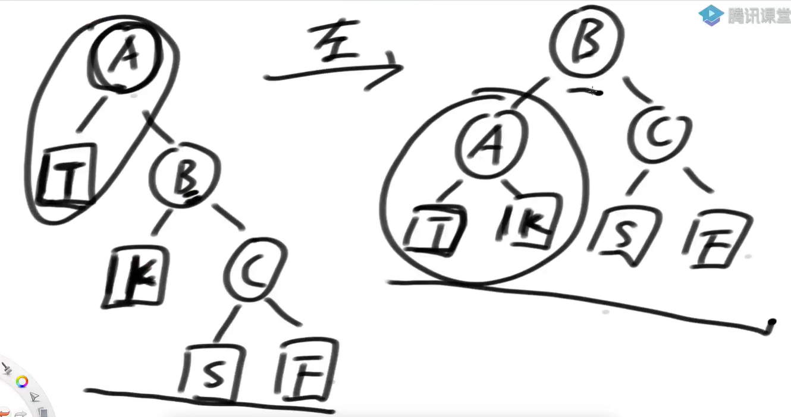
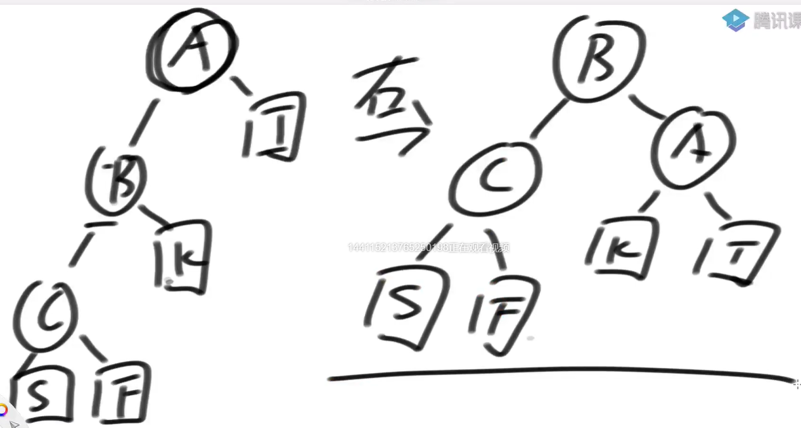
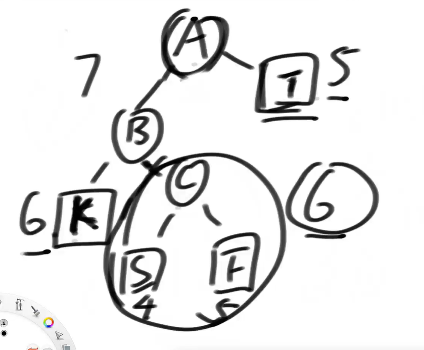

# <font color="red">**有序表**</font>

### 搜索二叉树
搜索二叉树一定要说明以什么标准来排序

经典的搜索二叉树，树上没有重复的用来排序的key值

如果有重复节点的需求，可以在一个节点内部增加数据项

搜索二叉树不接受重复的key


### 搜索二叉树查询key（查询某个key存在还是不存在）
1）如果当前节点的value==key，返回true

2）如果当前节点的value<key，当前节点向左移动

3）如果当前节点的value>key，当前节点向右移动

4）如果当前节点变成null，返回false


### 搜索二叉树插入新的key

和查询过程一样，但当前节点滑到空的时候，就插入在这里


### 搜索二叉树删除key
0）先找到key所在的节点

1）如果该节点没有左孩子、没有右孩子，直接删除即可

2）如果该节点有左孩子、没有右孩子，直接用左孩子顶替该节点

3）如果该节点没有左孩子、有右孩子，直接用右孩子顶替该节点

4）如果该节点有左孩子、有右孩子，用该节点后继节点顶替该节点
【后继节点：其右树上的最小节点（也就是有树上的最左节点）。或者是其左树上的最大节点（也就是左树上的最右节点）】


### 搜索二叉树特别不讲究
1）基础的搜索二叉树，添加、删除时候不照顾平衡性

2）数据状况很差时，性能就很差

给搜索二叉树引入两个动作：左旋、右旋
```shell
# 左旋:搜索二叉树向左倒，让头节点的右节点成为新头结点，头结点就会成为新头的左节点。
# 同时，新头的原左节点放在原头节点的右节点位置

# 右旋:搜索二叉树向右倒，让头节点的左节点成为新头结点，头结点就会成为新头的右节点。
# 同时，新头的原右节点放在原头节点的左节点位置

# 左旋、右旋是为了让树变的更平点，不让树过高.【概念理解起来可能会比较晦涩，可以看图理解】

### 左旋、右旋的时间复杂度都是 O(1)
```




### AVL树、SB树、红黑树的共性
1）都是搜索二叉树

2）插入、删除、查询（一切查询）搜索二叉树怎么做，这些结构都这么做

3）使用调整的基本动作都只有左旋、右旋

4）插入、删除时，从最底层被影响到的节点开始，对往上路径的节点做平衡性检查

5）因为只对一条向上路径的每个节点做O(1)的检查和调整， 所以可以做到O(logN)


### AVL树、SB树、红黑树的不同
1）平衡性的约束不同

AVL树最严格、SB树稍宽松、红黑树最宽松

2）插入、删除和搜索二叉树一样，但是额外，做各自的平衡性调整。各自的平衡性调整所使用的动作都是左旋或者右旋

### AVL树
1）最严格的平衡性，<font color="red">任何节点左树高度和右树高度差不超过1 </font>

2）从加入的节点开始，往上沿途检查每个节点时，都去检查四种违规情况：LL、RR、LR、RL

3）删除的时候：
    情况一：既没有左，也没有右。【从当前删除的节点开始，沿途检查LL、RR、LR、RL】
    情况二：有左无右、有右无左。【从当前删除的节点的左【右】开始，也就是新生成的当前节点开始，沿途检查LL、RR、LR、RL】
    情况三：既有左、也有右。【从右树上的最左节点的父节点、或左树上的最右节点的父节点开始。有就是从后继节点的父节点开始，沿途检查LL、RR、LR、RL】

```markdown
    LL:左树的左方向过长导致avl树是去平衡
    RR:右树的右方向过长导致avl树是去平衡
    LR:左树的右方向过长导致avl树是去平衡
    RL:右树的左方向过长导致avl树是去平衡

```
3）不同情况虽然看起来复杂，但是核心点是：
```markdown
    LL（做一次右旋）
    RR（做一次左旋）
    LR和RL（利用旋转让底层那个节点【当前头结点的孙子节点】上到顶部）【一般会经过两次旋转】【不用记】
    LR:两次旋转。当前头的左节点先左旋，再右旋
    RL:两次旋转。当前头的右节点先右旋，再左旋


    可能既是LL型，也是LR型。【左树的左、右高度一样，再加上左树根节点超过了右树高度加一】【此时按照LL型调整】
    可能既是RR型，也是RL型。【右树的左、右高度一样，再加上右树根节点超过了左树高度加一】【此时按照RR型调整】
```



### 数据库的索引系统
索引就是利用增强版的搜索二叉树【AVL、SB树、红黑树】</br>
在二叉树上，每个节点记录了当前记录的索引值与该记录在磁盘文件上的位置[key:索引，value:源记录的位置]。查询的时候，先查索引，再去查磁盘文件


### 有序表和 avl 树的关系

有序表：是接口名
avl树：是有序表的一个实现【sb树、红黑树、跳表、B树、B+树  都可以实现有序表】

有序表要求的性能：时间复杂度 O(logN)

有序表能实现的功能：
1. 像搜索二叉树一样实现增删改查
2. 