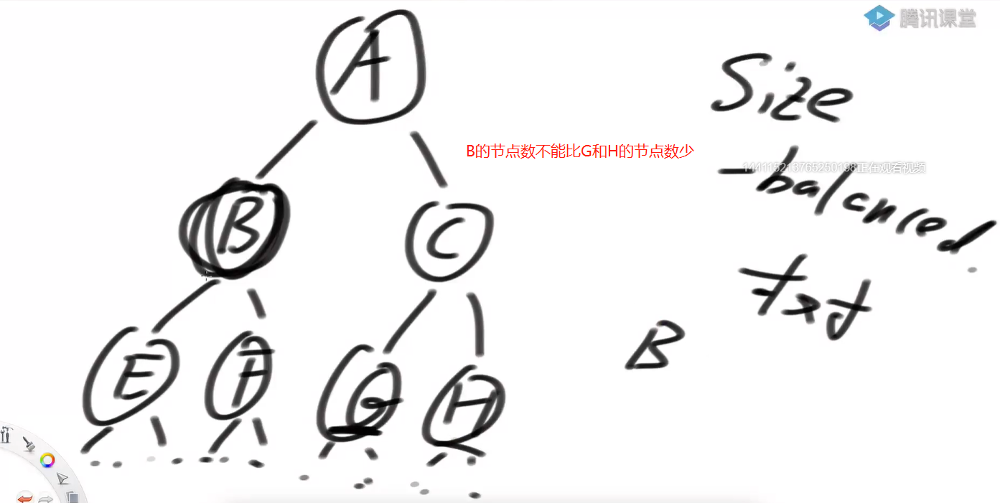

# <font color="red">**SB树（size-balance-tree）**</font>

### SB树（size-balance-tree）  
1. 让每一个叔叔节点为头的节点个数**都不少于**其任何一个侄子节点  

2. 也是从底层被影响节点开始向上做路径每个节点检查  

3. 与AVL树非常像，也是四种违规类型：</br>  
LL:左树的左树的节点个数 大于了右树 【三层的左左大于了二层的右】</br>  
RR、右树的右树的节点个数 大于了左树 【三层的右右大于了二层的左】</br>  
LR、左树的右树的节点个数 大于了右树 【三层的左右大于了二层的右】</br>  
RL、右树的左树的节点个数 大于了左树 【三层的右左大于了二层的左】</br>  

4. 与AVL树非常像，核心点是：  
LL（做一次右旋）  
RR（做一次左旋）    
LR和RL（利用旋转让底层那个上到顶部）  
【（利用旋转让底层那个节点【当前头结点的孙子节点】上到顶部）【一般会经过两次旋转】【不用记】】   

5. 与AVL树不同的是，**每轮经过调整后，谁的孩子发生变化了，谁就要再查【其树上的节点的叔侄关系发生了变化】【AVL不用这一步】**  
  

### SB树在使用时候的改进
1. 删除时候可以不用检查  【会让树变成棒状结构】【但是时间复杂度是按照加入节点时的最大节点数来算的(一个差不多平衡的数，被删成的。)  还是 logN 】  
2. 就把平衡性的调整放在插入的时候  【加入节点时，递归去调整叔侄关系发生变化的节点】【又会让树再次变成平衡】【能不调整就不调整(删除的时候不调整)】  
3. 因为这种只要变就递归的特性，别的树没有  
4. 可以在节点上封装别的数据项，来增加功能  


### 跳表（skip list）
1. 结构上根本**和搜索二叉树无关**  
2. 利用随机概率分布来使得高层索引可以无视数据规律，做到整体性能优良【添加数据的时候，该数据首先默认层数是最底层，然后以 0.5 的概率决定它是否出现在高层】</br>  

```shell
# 因为数据在每一层都是以 0.5 的概率决定是否出现在更上一层。所以每层的数据量是 N --> N/2 --> N/4 --> N/8 --> ...
# 有一半的概率（数据）会去到更高一层
# 节点进来的时候，从第一次（最底层）开始，0.5的概率，随机决定是否去上一层，一直随机。。。
# 直到随机到不能再去上一层的时候。就将节点挂进去【挂的时候从高层往底层挂，可以跳过底层的大部分节点】【时间复杂度 O(logN)】  
# 只是数据量上是差不多 上一层是下一层的一半，但是具体的数据是什么，哪些数据会出现在高层，哪些会出现在低层，是随机的
# 出现在上层的数据，肯定都会出现在下层。【因为决定的时候，是从低层往上的】
```

3. 思想是所有有序表中最先进的  
4. 结构简单就是多级单链表  
5. 对于有序表来说，不支持修改key。要想修改key，就先删除原来的key，再添加新的key。否则的话，原来的key被修改后，该节点该去哪，就懵逼了  


### 聊聊红黑树
1. 平衡性规定非常诡异  
2. 平衡性调整最为复杂  
3. 优点在于每次插入删除扰动较好，但是在今天看来这个优势也极其微弱了  
原因：贪图扰动小的话，B+树、2-3-4树可能更好，还是那句话，到底图什么  
4. 除此之外，红黑树并不比AVL树、SB树、跳表更加优秀  
5. 面试上遇到，说清楚道理，不行就举报  

