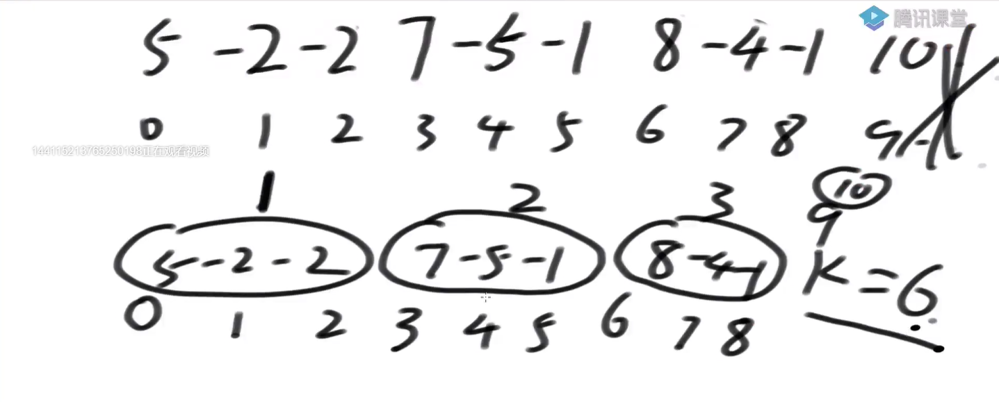
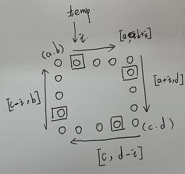
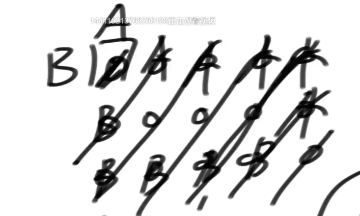
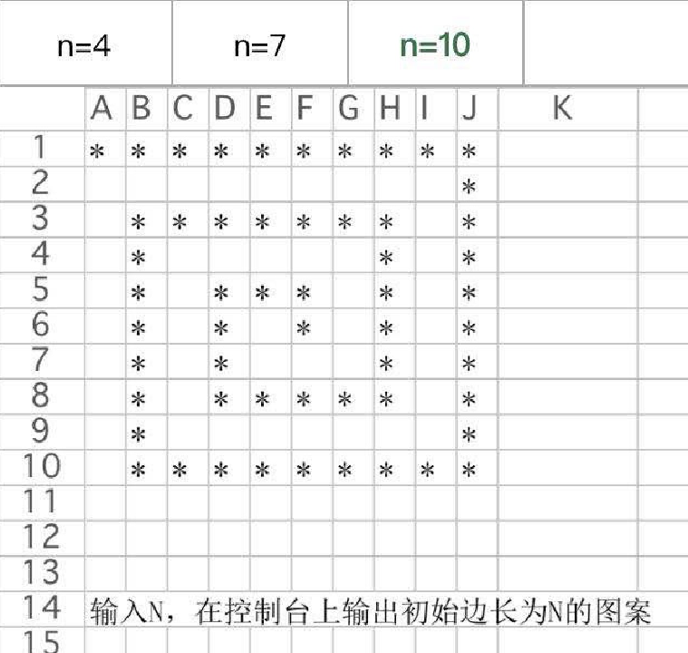

# <font color="red">**窗口和分圈**</font>


### 题目一
**Code01**
```text
给定一个正整数组成的无序数组arr，给定一个正整数值K
找到arr的所有子数组里，哪个子数组（连续）的累加和等于K，并且是长度最大的
【子数组是连续的。子序列是可以跳着选的】
返回其长度


解法是：利用一个窗口在数组上进行滚动。
窗口内的累加和小于目标值，窗口右边界向右扩
窗口内的累加和等于目标值，窗口右边界向右扩【主要是考虑 0 的情况。在等于的情况下，看看能不能扩的更宽】【等于的情况时，更新最大长度（答案）】
窗口内的累加和大于目标值，窗口左边界向右扩

为什么可以用窗口滑动来做。
因为原数组是正数数组，范围变大，累加和只会变的更大。
```


### 题目二
**Code02**
```text
给定一个整数组成的无序数组arr，值可能正、可能负、可能0
给定一个整数值K
找到arr的所有子数组里，哪个子数组的累加和等于K，并且是长度最大的
返回其长度


解法是：
看到子数组。就想到必须以某个位置结尾（开头）的情况会怎么怎么样。
本题准备一个key-value表。key是前缀和，value是该前缀和最早出现的位置

遍历源数组，要找 个子数组的累加和等于K 。来到某个位置的时候，就以该位置为终点，向前推。能推多远（取决于前缀和表中 当前位置的前缀和减去K  在表中第一次出现的位置）
也就是在以当前位置结尾的前缀和中，将其分为两部分，后一部分的和等于10，前一部分也就是前缀总会减去10.
要后一部分尽可能的长，那么前一部分就要尽可能的短（所以取其第一次出现的位置）


【在开始的时候，现在表中添加 (0,-1), 表示0这个前缀和，最早是出现在 -1 的位置】
不然可能会有问题。当某个位置的累加和刚好等于目标 K 的时候，
此时我们就需要去找累加和 K-K 第一次出现的位置。如果没有初始添加。那么此时会显示没有对应的子数组，但是，此时的这个数组的前半部分就是我们要找的答案
也就是错过从 0 开头，到当前位置结尾的答案。
```


### 题目三
```markdown
给定一个整数组成的无序数组arr，值可能正、可能负、可能0
给定一个整数值K
找到arr的所有子数组里，哪个子数组的累加和<=K，并且是长度最大的
返回其长度

准备两个辅助数组
minSum[]  :minSum[i]表示以`i`开头的子数组中，能够取到的最小累加和。。需要用到其后面的信息。所以从右往左算
minSumEnd[]  :minSumEnd[i]表示以`i`开头的子数组中，取到最小累加和时的子数组右边界。

解法：
如果minSum[i] > K 表示以i开头的子数组中，最小的累加和都大于K。也就是以 i 开头的所有子数组都不会 <=K
如果minSum[i] <= K
minSumEnd[i]表示以`i`开头的子数组中，取到最小累加和时的子数组右边界. 就再加上 `以这个右边界加1的位置为开始的最小累加和` 是否 <=K
一直往右，直到某个时刻 `>K` 就停止。那么 `<=K` 的就是其前面一块

因为这里记录的是`最小`累加和.不可能存在 <=K 的位置在某个块的中间。因为在一个累加和范围内，往后走，只会让当前累加和变小，如果到
其中间的某个位置能使其 <=K，那么当前累加和的往后的数加进来，也是 <=K 的。【见下图】


到此，以`i`开头的子数组中的 `<=K`的最大长度找到了。要考虑 `i+1` 位置。
将以`i`位置开头，能扩到的范围的累加和加起来，再将`arr[i]` 的元素去掉【也就是以 `i+1` 位置开头】，
看看能不能将下一块累加和吸收进来【如果能够吸收进来，就更新答案，不能照此去到`i+2`位置】

窗口的右边界不回退！！！
本题不是求每个位置的最优解，求的是看看能不能将下一块吸收进来，使得能够更新当前的最优解，
如果不能吸收进来，那就是不能更新当前的当前的最优解，也就不用去关心了【只收集答案，不更新最优解】

时间复杂度 O(N)
```



### 题目四
```markdown
给定一个数组arr，给定一个值v
求子数组平均值小于等于v的最长子数组长度


解法：
将原数组减去平均值得到处理数组
然后求处理数组中，累加和小于等于0的子数组【还原回去后，也就是平均值小于等于V】，哪个是最长的。
```


### 总结
```markdown
题目一主要技巧：利用单调性优化

题目二主要技巧：利用预处理结构优化【Code2】 + 讨论开头结尾

题目三主要技巧：假设答案法+淘汰可能性（很难，以后还会见到）【Code3】
```


### 题目五
```markdown
给定一个长方形矩阵matrix，实现转圈打印
a  b  c  d
e  f  g  h
i  j  k  L
打印顺序：a b c d h L k j i e f g


解法：一圈一圈的去考虑
```


### 题目六
**Code06**
```markdown
给定一个正方形矩阵matrix，原地调整成顺时针90度转动的样子
a  b  c		    g  d   a
d  e  f			h  e   b
g  h  i			i  f   c

解法：一圈一圈的去考虑。见图解
```



### 题目七
给定一个正方形或者长方形矩阵matrix，实现zigzag打印
0 1 2
3 4 5
6 7 8
打印: 0 1 3 6 4 2 5 7 8

解法：
```java
// 用两个坐标表示一条线段，再用一个 boolean 表示方向
// 全局控制：坐标同时向右下移动
```



### 题目八


```markdown
解法：也是分圈结构。转圈的时候，得留一个位置，别碰上。

一圈是两层。【向左、向下、向右、向上】
```

