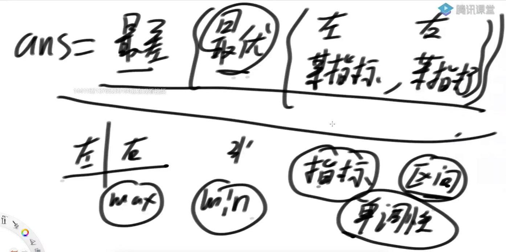

# <font color="red">**四边形不等式**</font>

<font color="red">**区间划分问题中的划分点不回退现象**</font>
### 题目一
**Code01**
```text
给定一个非负数组arr，长度为N，
那么有N-1种方案可以把arr切成左右两部分
每一种方案都有，min{左部分累加和，右部分累加和}
求这么多方案中，min{左部分累加和，右部分累加和}的最大值是多少？
整个过程要求时间复杂度O(N)


解法：
先求出全局的累加和
从左到右慢慢扩充，。
得出左边的累加和，在用总的累加和减去左边的累加和，得到右边的累加和。取出当前位置的左右两个累加和的最小值
再去更新答案（比当前答案大，就更新，否则不更新）

时间复杂度 O(N)
```

### 题目二
**Code02**
```text
把题目一中提到的，
min{左部分累加和，右部分累加和}，定义为S(N-1)，也就是说：
S(N-1)：在arr[0…N-1]范围上，做最优划分所得到的min{左部分累加和，右部分累加和}的最大值
现在要求返回一个长度为N的s数组，
s[i] =在arr[0…i]范围上，做最优划分所得到的min{左部分累加和，右部分累加和}的最大值
得到整个s数组的过程，做到时间复杂度O(N)

解法：
如果在[0...17]范围上的划分为[0...8][9...17]
那么[0...18]上的划分就不用再去考虑[0...0][0...1][0...2] ...  [0...7]
从 [0...8] 开始往后试。【因为都是正数。右半部分加一个数，其累加和只会比当前位置的右半部分累加和大】

如此，不需要回退。其时间复杂度就是 O(N)
```


### 四边形不等式技巧特征

```markdown
1，两个可变参数（L,R）的区间划分问题
2，每个格子有枚举行为
3，当两个可变参数固定一个，另一个参数和答案之间存在单调性关系【反向单调】
4，而且两组单调关系是反向的：(升 升，降 降)  (升 降，降 升)
5，能否获得指导枚举优化的位置对：上+右，或者，左+下


好处是：可以将 O(N^3) 降到 O(N^2)
```



### 四边形不等式技巧注意点

```markdown
1，不要证明！用对数器验证！
2，枚举的时候面对最优答案相等的时候怎么处理？用对数器都试试！
3，可以把时间复杂度降低一阶
    O(N^3) -> O(N^2)
    O(N^2 * M) -> O(N * M)
    O(N * M^2) -> O(N * M)
4，四边形不等式有些时候是最优解，有些时候不是
不是的原因：尝试思路，在根儿上不够好

```


### 题目五
**Code03**
```markdown
摆放着n堆石子。现要将石子有次序地合并成一堆
规定每次只能选相邻的2堆石子合并成新的一堆，
并将新的一堆石子数记为该次合并的得分。【如果只有一堆，就不需要合，也就是得分为0】
求出将n堆石子合并成一堆的最小得分（或最大得分）合并方案


解法：
考虑[L,R]范围上，怎么合成最优。
范围上的尝试，[L]...[L+1,R]     [L,L+1]...[L+2,R]  ... 依次类推
得到每一次划分的结果后，取最小值
```


### 题目六

**Code04**
```markdown
给定一个整型数组 arr，数组中的每个值都为正数，表示完成一幅画作需要的时间，再 给定 一个整数 num，表示画匠的数量，每个画匠只能画连在一起的画作。所有的画家 并行工作，请 返回完成所有的画作需要的最少时间。
【举例】
arr=[3,1,4]，num=2。
最好的分配方式为第一个画匠画 3 和 1，所需时间为 4。第二个画匠画 4，所需时间 为 4。 因为并行工作，所以最少时间为 4。如果分配方式为第一个画匠画 3，所需时 间为 3。第二个画 匠画 1 和 4，所需的时间为 5。那么最少时间为 5，显然没有第一 种分配方式好。所以返回 4。
arr=[1,1,1,4,3]，num=3。
最好的分配方式为第一个画匠画前三个 1，所需时间为 3。第二个画匠画 4，所需时间 为 4。 第三个画匠画 3，所需时间为 3。返回 4。

```


