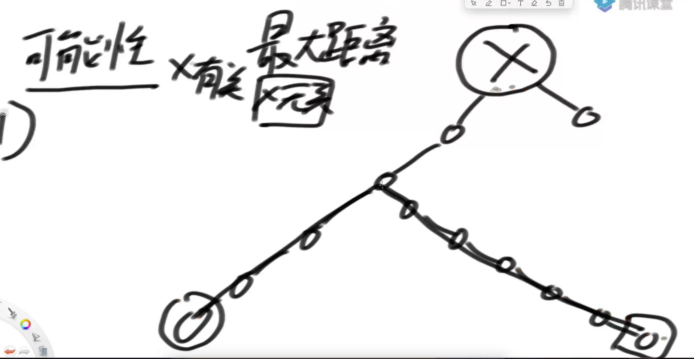

### 二叉树的递归套路
**可以解决面试中绝大多数的二叉树问题尤其是树型dp问题** **本质是利用递归遍历二叉树的便利性**

##### 判断二叉树是否是完全二叉树
`对于一个二叉树的每一层来说，要么是满的【既有左节点又有右节点】，要么是最后一层不满。就算是不满，也是从左到右排好的`
**满足的原则【处理的方式是按层遍历】**
* 1）如果某个节点`X`有右孩子，但是没有左孩子，毫无疑问不是完全二叉树
* 2）如果在按层遍历的过程中，如果遇到一个节点子节点不全`{有左无右，或者左右接无}` 。那么接下来遍历的节点必须都是叶子节点【左右都没有】

##### 给定一棵二叉树的头节点head，返回这颗二叉树是不是平衡二叉树
`在一个二叉树中，每一颗树的左树高度和右树高度相差的最大值不超过 1`
**【每一个节点皆需要满足下面的三个条件】**
* 1）左树是平衡二叉树
* 2）右树是平衡二叉树
* 3）左右树的高度差不大于 1

##### 判断二叉树是否是搜索二叉树
`在二叉树中，左树上的值都小于头结点、右树上的值都大于头节点[经典的搜索二叉树中是没有重复值的]`
**【每一个节点皆需要满足下面的三个条件】**
* 1）左树是搜索二叉树
* 2）右树是搜索二叉树
* 3）左树上的最大值必须小于当前节点的值，右树上的最小值也必须大于当前节点的值

##### 求最大距离
`给定一棵二叉树的头节点head，任何两个节点之间都存在距离【可以理解为有一个距离对照表】【也可以理解为求沿途的节点数量最多的路径】， 返回整棵二叉树的最大距离`
**【每一个节点皆需要满足下面的三个条件】**

* 1）左树上有最大距离【与当前节点无关】【左树上的某两个点的距离可能不通过当前节点】
* 2）右树上有最大距离【与当前节点无关】
* 3）左树离当前节点最远【左树高度】`加`右树离当前节点最远【右树高度】`加1` 【与当前节点有关】

##### 判断一颗树是否是满二叉树
`给定一棵二叉树的头节点head，返回这颗二叉树是不是满二叉树`
**满二叉树【总节点树=2^h-1】**
* 1）左树是满二叉树
* 2）右树是满二叉树
* 3）当前节点满足【总节点树=2^h-1】

##### 二叉树中最大的二叉搜索子树的大小
`给定一棵二叉树的头节点head， 返回这颗二叉树中最大的二叉搜索子树的大小`
* 1）当前节点X不做头的时候。
    X左树上的最大搜索二叉树的大小
    X右树上的最大搜索二叉树的大小
* 2）当前节点X做头的时候。
    X左树是不是搜索二叉树
    X右树是不是搜索二叉树
    X左树上的最大值是否小于当前节点的值，右树上的最小值是否大于当前节点的值
【定义信息体如下】  
* 3）X为节点的树上的最大二叉搜索子树的大小
* 4）X为节点的树上的size大小
* 5）X为节点的树的最大、最小值

### 总结
**上面所有这些题目，时间复杂度都是 O(n) 。都是最优解。**
**过程都相当于是完成了一个后序遍历**
* 1）思想提醒【不管遇到二叉树的什么题，都想着以X节点为头的时候，那个目标怎么实现】【可以向左右树要简单信息】
* 2）写程序的时候极度模板化【设计信息体】【完成信息体的封装】
