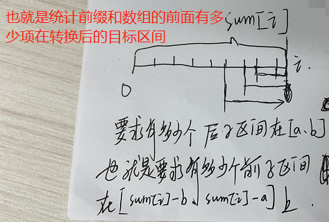
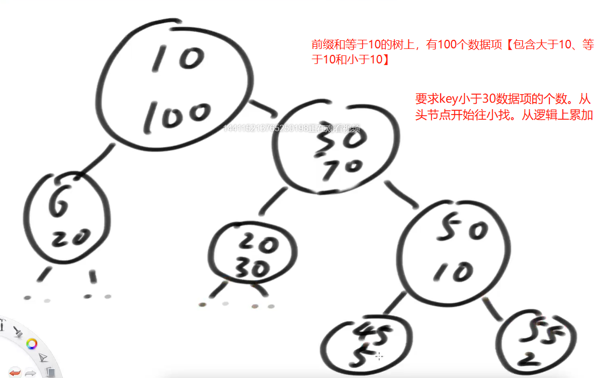

# <font color="red">**有序表题目**</font>   

### 题目一   
**【Code01】**   
给定一个数组arr，和两个整数a和b（a<=b）</br>   
求arr中有多少个子数组，累加和在[a,b]这个范围上</br>   
返回达标的子数组数量</br>   

```shell
# 先有一个累加和数组 sum[]
# 求出以 i 结尾的数组中，有多少个子数组的累加和在[a,b]范围上
# 也就是求以 i 结尾的累加和数组中，有多少数字落在[ sum[i]-b,sum[i]-a ]的区间上【sum[i]是原数组的前 i 项之和。这是求转化之和的区间。可以利用画图推倒】
# 实现方式。利用有序表来存储前缀和，在每个节点上，加一个数据项，来表示当前树上也多少个数据项【该数据项不是平衡因子，平衡因子额外维护】
# 要求某个数的前缀和的时候，从头节点开始，依次向下找，目标数小于当前节点的key，就向左滑动，目标数小大于当前节点的key，就向右滑动。
# 在滑动的时候，
# 向右边滑动，就不要累加，向右滑动，就将当前节点负责的数据项的个数和左树上的数据项个数累加
# 向左滑动的时候，就不要累加。
# 【不要直接用前缀和来统计，防止有前缀和相等的情况。有序表不支持相等的情况】
# 要求某个前缀和出现的个数【可以用当前前缀和树的节点的对应数据项 减去其左树上对应的数据项 再减去其右树上对应的数据项】

# 时间复杂度 O(NlogN)
```
   
    

### 题目二
**【Code02】**   
有一个滑动窗口（讲过的）：</br>   

1. L是滑动窗口最左位置、R是滑动窗口最右位置，一开始LR都在数组左侧</br>   
2. 任何一步都可能R往右动，表示某个数进了窗口</br>   
3. 任何一步都可能L往右动，表示某个数出了窗口</br>   

想知道每一个窗口状态的中位数</br>   

```shell

# 也是如上题，改写有序表【对每个节点，增加附加数据项【存储当前树上的数据项个数（包括小于、等于和大于当前key的）】】
# L往右滑动的时候，就删除数据
# R往右滑动的时候，就增加数据
# 要求某个瞬间[L,R]范围内的中位数。【拿到当前树上的数据项个数。奇数项，就去拿中间的一个数。偶数项，就去拿中间两个数，求平均数】

# 对数据结构的要求
# 1）可以插入重复数字
# 1）可以删除单个数字【删除的时候，如果节点的数据项大于1，不要直接删节点，数据项减 1 就行。】
# 3）可以取到当前结构上的 index 位置的数【取的时候，对比左、右树的数据项个数找到对应的位置】


# 时间复杂度 O(NlogN)
```

### 题目三
**【Code03】**   
设计一个结构包含如下两个方法：</br>   
void add(int index, int num)：把num加入到index位置【如果对应的 index 位置上有数字，就将其后移】</br>   
int get(int index) ：取出index位置的值</br>   
void remove(int index) ：把index位置上的值删除</br>   
要求三个方法时间复杂度O(logN)</br>   
```shell
# 修改有序表
# 增加数据项size，表示当前树的数据项个数【包括大于、小于和等于】
# 在该搜索二叉树不是以值来做排序的。而是以位置（index）来做排序的【自然也就可以添加相同的值】
# 这里的index是排序之前的原始数组的下标。
# 节点不需要维护 index。增删改查的时候，通过 size 来定位

# 左、右旋转的时候，是不会改变自然时序的。我们这里是利用自然时序（index）来排序，也就是作为搜索二叉树的key
```

### 改写有序表的题目核心点   
1. 分析增加什么数据项可以支持题目</br>   
2. 有序表一定要保持内部参与排序的key不重复</br>   
3. 增加这个数据项了，在平衡性调整时，保证这个数据项也能更新正确</br>   
4. 做到上面3点，剩下就是搜索二叉树怎么实现你想要的接口的问题了</br>   


